# FFDNet

# [FFDNet: Toward a Fast and Flexible Solution for CNN based Image Denoising](https://arxiv.org/pdf/1710.04026.pdf)


# Abstract
Due to the fast inference and good performance, discriminative learning methods have been widely studied in image denoising. However, these methods mostly learn a specific model for each noise level, and require multiple models for denoising images with different noise levels. They also lack flexibility to deal with spatially variant noise, limiting their applications in practical denoising. 
To address these issues, we present a fast and flexible denoising convolutional neural network, namely FFDNet, with a tunable noise level map as the input. 
The proposed FFDNet works on downsampled subimages,achieving a good trade-off between inference speed and
denoising performance. In contrast to the existing discriminative denoisers, FFDNet enjoys several desirable properties, including

- the ability to handle a wide range of noise levels (i.e., [0, 75]) effectively with a single network, 
- the ability to remove spatially variant noise by specifying a non-uniform noise level map, and 
- faster speed than benchmark BM3D even on CPU without sacrificing denoising performance. 

Extensive experiments on synthetic and real noisy images are conducted to evaluate FFDNet in comparison with state-of-the-art denoisers. The results show that FFDNet is effective and efficient, making it highly attractive for practical denoising applications.

# Network Architecture

The input image is reshaped to four sub-images, which are then input to the CNN together with a noise level map. The final output is reconstructed by the four denoised sub-images

# Test FFDNet Models
- [Demo_AWGN_Gray.m](Demo_AWGN_Gray.m) is the testing demo of FFDNet for denoising grayscale images corrupted by AWGN.
- [Demo_AWGN_Color.m](Demo_AWGN_Color.m) is the testing demo of FFDNet for denoising color images corrupted by AWGN.

- [Demo_AWGN_Gray_Clip.m](Demo_AWGN_Gray_Clip.m) is the testing demo of FFDNet for denoising grayscale images corrupted by AWGN with clipping setting.
- [Demo_AWGN_Color_Clip.m](Demo_AWGN_Color_Clip.m) is the testing demo of FFDNet for denoising color images corrupted by AWGN with clipping setting.

- [Demo_REAL_Gray.m](Demo_REAL_Gray.m) is the testing demo of FFDNet for denoising real noisy (grayscale) images.
- [Demo_REAL_Color.m](Demo_REAL_Color.m) is the testing demo of FFDNet for denoising real noisy (color) images.

- [Demo_multivariate_Gaussian_noise.m](Demo_multivariate_Gaussian_noise.m) is the testing demo of FFDNet for denoising noisy images corrupted by multivariate (3D) Gaussian noise model `N([0,0,0]; Sigma)` with zero mean and covariance matrix `Sigma` in the RGB color space.


# Results on Real Noisy Images from [The Darmstadt Noise Dataset](https://noise.visinf.tu-darmstadt.de/benchmark/#results_srgb)

## PSNR: 37.61dB


The left is the noisy image from [The Darmstadt Noise Dataset](https://noise.visinf.tu-darmstadt.de/benchmark/#results_srgb). The right is the denoised image by FFDNet+.

 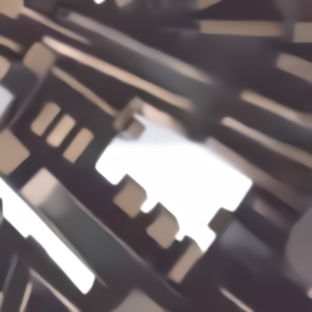

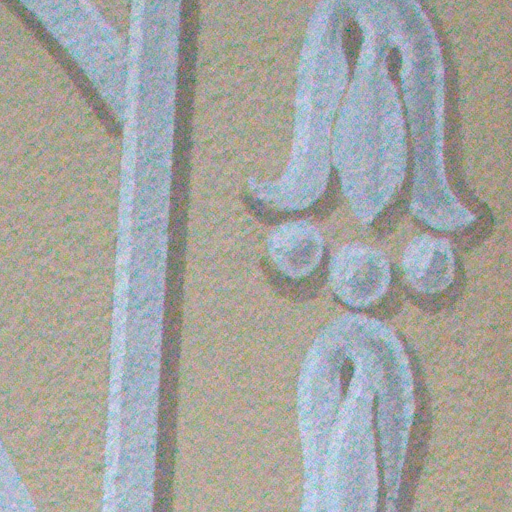 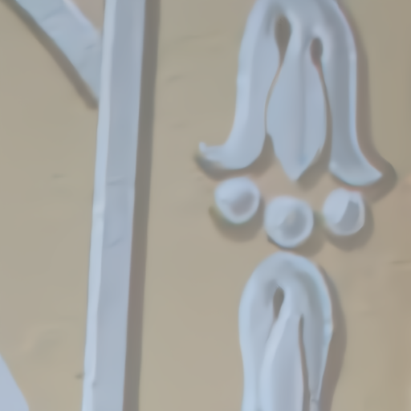

 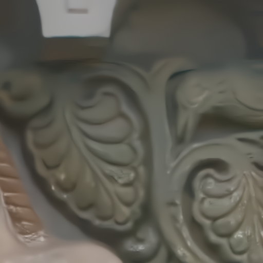

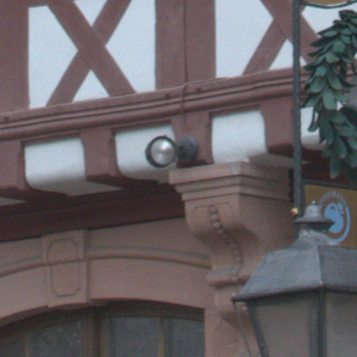 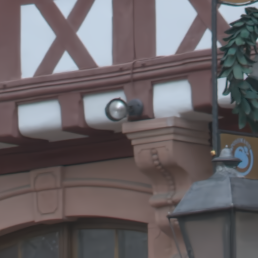


# Image Denoising for AWGN

Grayscale Image Denoising

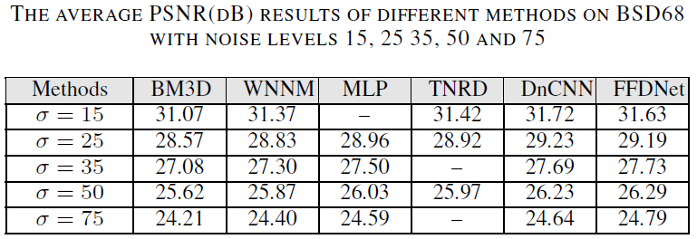 

Color Image Denoising

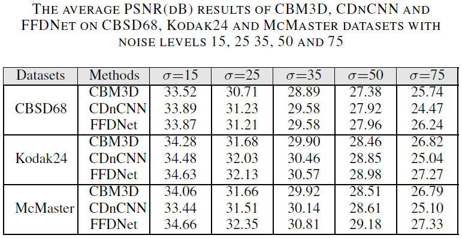 

The left is the noisy image corrupted by AWGN with noise level 75. The right is the denoised image by FFDNet.

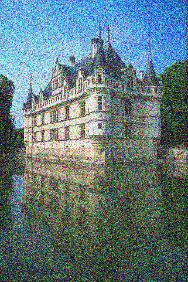 

# Real Image Denoising

The left is the real noisy image. The right is the denoised image by FFDNet.

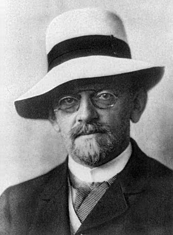 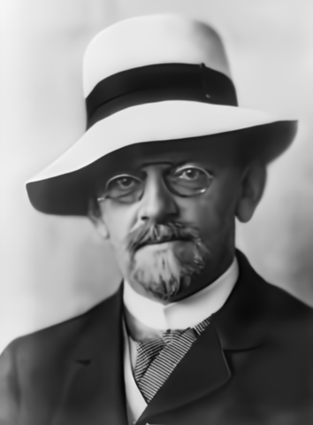


# Requirements and Dependencies
To run the code, you should install Matconvnet first. 
Alternatively, you can use function [vl_ffdnet_matlab](utilities/vl_ffdnet_matlab.m) to perform denoising without Matconvnet.
- MATLAB R2015b
- [Cuda](https://developer.nvidia.com/cuda-toolkit-archive)-8.0 & [cuDNN](https://developer.nvidia.com/cudnn) v-5.1
- [MatConvNet](http://www.vlfeat.org/matconvnet/)

# Citation
```
@article{zhang2018ffdnet,
  title={FFDNet: Toward a Fast and Flexible Solution for {CNN} based Image Denoising},
  author={Zhang, Kai and Zuo, Wangmeng and Zhang, Lei},
  journal={IEEE Transactions on Image Processing},
  year={2018},
}
```


